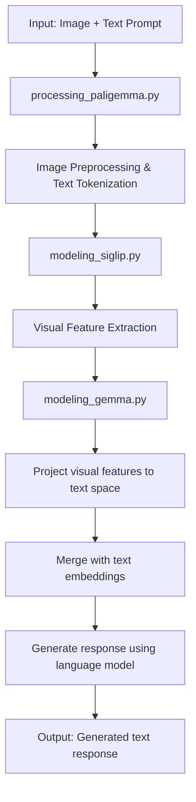

# PaliGemma Vision-Language Model Implementation

A from-scratch implementation of the PaliGemma Vision-Language Model (VLM) that combines image understanding with text generation capabilities.

## Overview

PaliGemma is a multimodal AI model that can understand images and generate relevant text responses. This implementation recreates the model architecture from scratch using PyTorch.

## Architecture Flow



## Component Architecture

### 1. `processing_paligemma.py` - Input Processing
- **Image Processing**: Resize, normalize, and prepare images for the vision encoder
- **Text Processing**: Tokenize text and insert special `<image>` tokens
- **Unified Processing**: Combines both modalities into model-ready format

### 2. `modeling_siglip.py` - Vision Encoder
- **SigLIP Vision Transformer**: Processes images into meaningful feature representations
- **Patch Embeddings**: Converts images into sequence of patch embeddings
- **Multi-head Attention**: Captures spatial relationships between image patches
- **Output**: Visual features `[Batch, Num_Patches, Embed_Dim]`

### 3. `modeling_gemma.py` - Language Model & Integration
- **Gemma Language Model**: Advanced decoder-only transformer for text generation
- **Multimodal Projector**: Bridges vision and text representations
- **Feature Merging**: Combines visual and textual embeddings
- **Text Generation**: Produces coherent responses based on image-text understanding

## Key Features

- ✅ **Complete Architecture**: Full implementation of PaliGemma model components
- ✅ **Vision Understanding**: SigLIP-based image processing and feature extraction
- ✅ **Advanced Language Model**: Gemma transformer with rotary embeddings and KV-caching
- ✅ **Multimodal Integration**: Seamless combination of visual and textual information
- ✅ **Pre-trained Weights**: Support for loading official PaliGemma weights
- ✅ **Efficient Inference**: Optimized generation with key-value caching

## Data Flow

1. **Input Processing**
   ```
   Image + "What color is the car?" 
   → "<image><image>...<bos>What color is the car?\n" + processed_image_tensor
   ```

2. **Vision Processing**
   ```
   Raw Image → Patches → SigLIP Encoder → Visual Features [1, 256, 768]
   ```

3. **Multimodal Integration**
   ```
   Visual Features + Text Embeddings → Combined Sequence → Attention Mechanism
   ```

4. **Text Generation**
   ```
   Combined Features → Gemma Language Model → "The car is red."
   ```

## Project Structure

```
├── modeling_gemma.py          # Language model & integration logic
├── modeling_siglip.py         # Vision encoder implementation  
├── processing_paligemma.py    # Input preprocessing
├── utils.py                   # Model loading utilities
├── run_inference.py           # Inference script
├── run_inference.sh           # Shell script for easy execution
├── images/                    # Sample images
│   ├── car.jpg
│   └── dogs.jpg
└── paligemma/                 # Pre-trained model weights
    ├── config.json
    ├── model-*.safetensors
    └── tokenizer files
```

## Usage

### Running Inference

```bash
python run_inference.py \
    --model_path "./paligemma/" \
    --prompt "Describe this image" \
    --image_file_path "images/car.jpg" \
    --max_tokens_to_generate 100
```

### Using the Shell Script

```bash
bash run_inference.sh
```

## Technical Details

### Model Specifications
- **Vision Encoder**: SigLIP Vision Transformer
- **Language Model**: Gemma (2B parameters)
- **Image Resolution**: 224x224 pixels
- **Patch Size**: 16x16 pixels
- **Context Length**: Up to 8192 tokens

### Key Innovations
- **Rotary Position Embeddings**: Better positional understanding
- **RMS Normalization**: More stable training than LayerNorm
- **Grouped Query Attention**: Efficient attention computation
- **SwiGLU Activation**: Enhanced MLP performance

## Requirements

- Python 3.8+
- PyTorch 2.0+
- Transformers library
- PIL (Python Imaging Library)
- SafeTensors
- Fire (for CLI)

## Model Weights

This implementation supports loading pre-trained PaliGemma weights. Place the model files in the `paligemma/` directory:
- Configuration files (`config.json`, `tokenizer.json`, etc.)
- Model weights (`model-*.safetensors`)

## License

This is an educational implementation for learning purposes. Please refer to the original PaliGemma license for commercial usage guidelines.